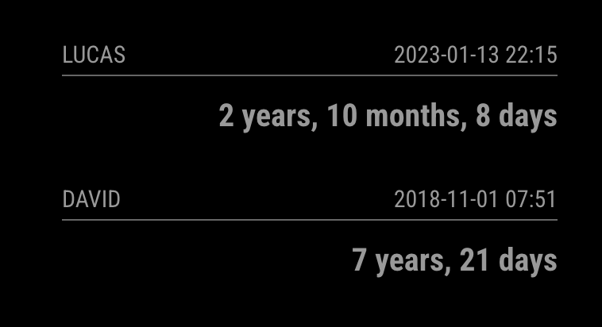

# MMM-Humanize-Duration

This a module for the [MagicMirror](https://github.com/MichMich/MagicMirror).

This module converts an interval into human readable units.

## Motivation

I just had a baby, and I wanted a geeky way to keep track of his exact age, so...

You can also use it to track any other past (or future) events!

Underneath, it's just a simple wrapper around [HumanizeDuration.js](https://github.com/EvanHahn/HumanizeDuration.js)

## Screenshot



## Installation

```bash
git clone https://github.com/ryck/MMM-Humanize-Duration.git && cd MMM-Humanize-Duration && npm install && cd ..
```

## Config

The entry in `config.js` can include the following options:

| Option             | Description                                                                                                                                                                                                                                     |
| ------------------ | ----------------------------------------------------------------------------------------------------------------------------------------------------------------------------------------------------------------------------------------------- |
| `date`             | A date to track.<br><br>**Type:** `string`                                                                                                                                                                                                      |
| `options`          | [HumanizeDuration.js](https://github.com/EvanHahn/HumanizeDuration.js#options) options.<br><br>**Type:** `object`<br>**Default:** `{ round: true, units: ["y", "mo", "w", "d"], largest: 3, language: config.language }`                        |
| `updateInterval`   | How often the arrival information is updated.<br><br>**Type:** `integer`<br>**Default:** `1 min`                                                                                                                                                |
| `initialLoadDelay` | The initial delay before loading. If you have multiple modules that use the same API key, you might want to delay one of the requests. (Milliseconds) <br><br>**Type:** `integer`<br>**Possible values:** `1000` - `5000` <br> **Default:** `0` |
| `animationSpeed`   | Speed of the update animation. (Milliseconds) <br><br>**Type:** `integer`<br>**Possible values:**`0` - `5000` <br> **Default:** `500` (2 seconds)                                                                                               |
| `debug`            | Show debug information. <br><br> **Possible values:** `true` or `false` <br> **Default:** `false`                                                                                                                                               |
| `showDate`         | Display the configured `date` as a secondary line above the humanized duration. <br><br>**Type:** `boolean` <br> **Default:** `false`                                                                                                           |

Here is an example of an entry in `config.js`

```
{
	module: 'MMM-Humanize-Duration',
	position: 'bottom_left',
	header: 'David',
	config: {
		date: "2018-11-01 07:51",
		options: {
			units: ["y", "mo", "w", "d", "h", "m", "s"],
			round: true,
			largest: 5,
		},
		updateInterval: 1 * 1 * 1000,
		animationSpeed: 250,
		initialLoadDelay: 0,
		showDate: true,
		debug: false
	}
},
```

## Dependencies

- [HumanizeDuration.js](https://github.com/EvanHahn/HumanizeDuration.js) (installed via `npm install`)

## Thanks To...

- [Evan Hahn](https://github.com/EvanHahn/) for the fastastic HumanizeDuration.js library
- [Michael Teeuw](https://github.com/MichMich) for the [MagicMirror2](https://github.com/MichMich/MagicMirror/) framework that made this module possible.
